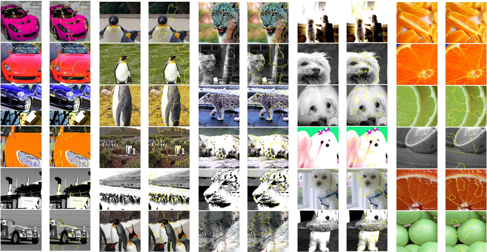
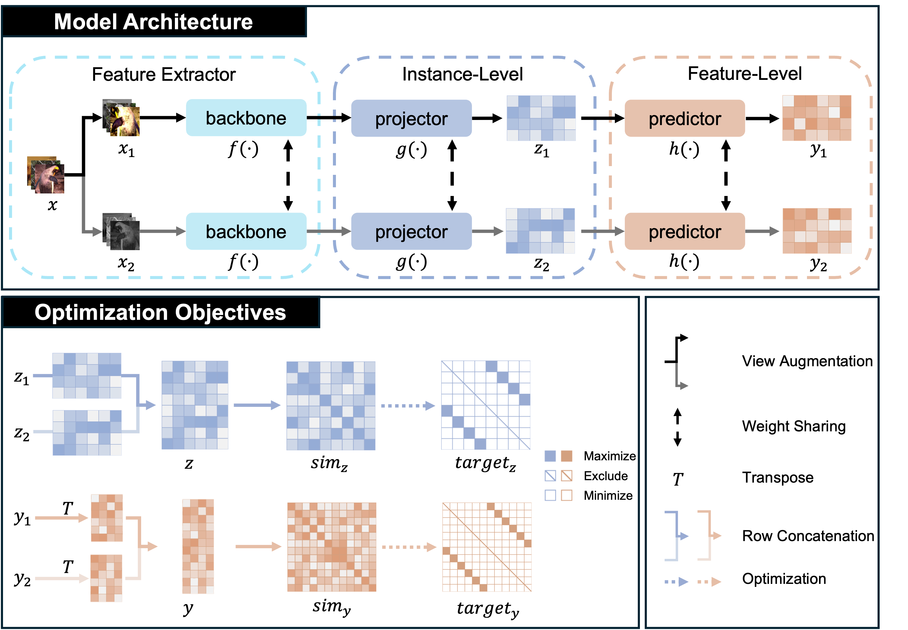
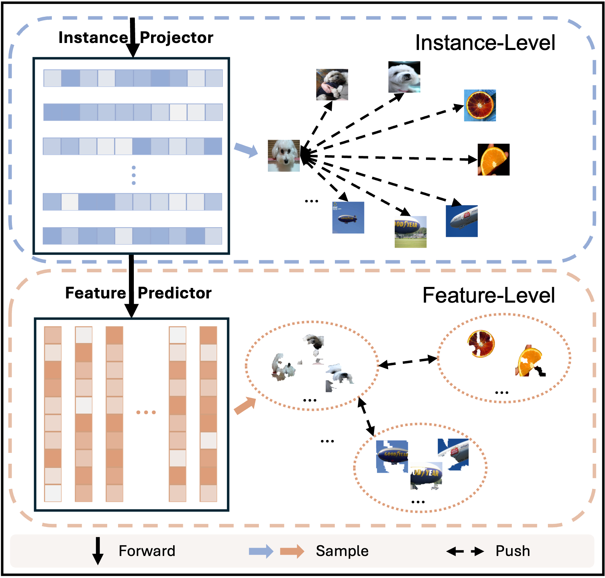

# Learning Fine-grained Representations Without ANY Class Priors

If the data is unlabeled, why should we rely on knowing the number of classes to construct a network for unsupervised learning? Is the number of classes always important? Could it be possible that class labels don't fully capture the finer-grained features within the dataset? For example, in a dataset of cats vs. dogs, breaking the labels further into white cats, non-white cats, and dogs is also a valid categorization.

In this project, we propose a new model framework that eliminates the implicit assumption of relying on the number of classes, thus avoiding constraining the model to predefined tasks. This approach allows us to capture richer, fine-grained features within the data.

The figures below showcase the LIME (Local Interpretable Model-Agnostic Explanations) visualizations of the feature prediction heads from the pre-trained model, as well as the contrastive learning structure used in the model.

| Yellow-circled |       |
| -------------- | ------------------------------------- |
| Unmasked       |  |

|  |  |
| -------------------------------- | ------------------------------- |

The following table presents the t-SNE visualizations of the model's feature extraction layer (Backbone) and the output layer (Feature Predictor).

|          | CIFAR-10                                             | CIFAR-100-20                                          | STL-10                                                  | ImageNet-10                                        |
| -------- | ---------------------------------------------------- | ----------------------------------------------------- | ------------------------------------------------------- | -------------------------------------------------- |
| Backbone | .png) | .png) | .png) | .png) |
| Feature  | .png)  | .png)  | .png)  | .png)  |

## Experimental Setup

We used the following hardware and software environment for the experiments:

- **Hardware**:
  - NVIDIA RTX 3090 (24GB)
  - 18 vCPU AMD EPYC 9754 128-Core Processor

- **Software Environment**:
  - Python 3.10
  - PyTorch 2.1.2 + cu121

While we used a relatively recent configuration, it is not mandatory to strictly follow this setup. The code should work on earlier versions as well. We have successfully tested the code in the following environments:

- Python 3.8
- PyTorch 1.11.0 + cu113

When the batch size is set to 128, the memory usage will reach **over 11GB**.

**Estimated Training Time (Based on the Current Configuration)**

| Dataset     | Time per Epoch   | Total Time (1000 epochs) |
| ----------- | ---------------- | ------------------------ |
| STL-10      | 38 seconds       | 10.5 hours               |
| ImageNet-10 | 40 seconds       | 11.1 hours               |
| CIFAR-10    | 2m 51s (171 sec) | 47.5 hours               |
| CIFAR-100   | 2m 51s (171 sec) | 47.5 hours               |

If you choose to log all metrics after each epoch, the total experiment time might double.

# Quick Start

## Dataset Download

CIFAR-10, CIFAR-100, and STL-10 can be automatically downloaded. For **ImageNet-10**, you can use Kaggle to download it from the command line:

```bash
kaggle datasets download -d liusha249/imagenet10
```

(Model uploading and wandb logging are in progress and are expected to be shared by September 12th.)

## How to Use Trained Model

We provide a `How to Use Trained Model.ipynb` file to help you quickly view the metrics of the pre-trained models. Additionally, we include a **toy example** that demonstrates how to apply the model to downstream tasks. We hope this example is helpful to you.

# Appendix

Here, we address some potential questions you may have:

1. **Why is there special handling for CIFAR-100 in `dataset.py`?**

   This is to ensure consistency with the paper's description. Based on [CC](https://arxiv.org/pdf/2009.09687) and [PICA](https://openaccess.thecvf.com/content_CVPR_2020/papers/Huang_Deep_Semantic_Clustering_by_Partition_Confidence_Maximisation_CVPR_2020_paper.pdf) as well as earlier papers, it was noted that they actually use the CIFAR-100 super-classes as labels (i.e., CIFAR-100-20). This doesn’t affect the model’s training; models trained on CIFAR-100-20 can be directly evaluated on CIFAR-100 with all 100 classes.

   While reproducing the CC experiment, we found that their open-source code did not map CIFAR-100 to super-classes despite using 20 classes in the paper. To address this, we redefined CIFAR-100 according to PICA’s definition. This could explain why the CIFAR-100 baseline in our paper is slightly lower than in the original. To avoid confusion, we have provided a full record of the metric curves, which you can view [here](https://wandb.ai/hoper-hw/CFL-cifar100/reports/CD-vs-CC-BS256-CIFAR-100--Vmlldzo5MTU3ODY0?accessToken=cz7tu971sasummgncnn49w1jgr7c7l42ngqrkgzaqux8kzn8exuglfi85lu14lwo).

2. **Why is the STL-10 baseline lower than in the original CC paper?**

   When reproducing the CC experiment, we discovered that CC actually used **train (5,000) + test (8,000) + unlabeled (100,000)** data for training, not just the train and test data. The original baseline also used unlabeled data, which explains why training on STL-10 took the longest in the CC paper (160 GPU-hours on STL-10). The process involved first training on the unlabeled data at the instance level, followed by normal training on the **train + test** dataset using the CC architecture. However, instance-level training was not the primary focus of the CC paper; it was more of a SimCLR characteristic.

   We know that adding more data at the instance level leads to performance gains, as it doesn't rely on prior knowledge. However, proper evaluation of a model’s performance should ensure that all models are trained consistently. Otherwise, the model can be trained with unlabeled data during each epoch, which would lead to improvements, but the gains may not be attributed entirely to the proposed method. This is not to diminish CC or its predecessors. In fact, CC itself outperformed previous baselines even when trained for 11 GPU-hours on **train + test** alone, without using unlabeled data.

   To ensure a proper comparison of our model’s effectiveness, we retrained CC on the **train + test** data for STL-10. You can view the complete experimental record [here](https://wandb.ai/hoper-hw/CFL-stl10/reports/CD-vs-CC-BS256-STL-10--Vmlldzo5MTU3OTM1?accessToken=um3y7bsplqdiz6slkt034ht8dras7f0en0ymkufy78fh6btcrij1qg4zimiohovy).

   Additionally, we reproduced results for other datasets in the same environment (without changing the baseline in the paper, but to provide a comparative demonstration). The results were mostly consistent with the original CC paper. Check out the comparisons for other datasets: [CIFAR-10](https://wandb.ai/hoper-hw/CFL-cifar10/reports/CD-vs-CC-BS256-CIFAR-10--Vmlldzo5MjU4ODY0?accessToken=y2auazsouib91c2bsj1ujxbwgv9dr7001hxih4xbdkc5wgjwtrs2sbrjghny4kzp) and [ImageNet-10](https://api.wandb.ai/links/hoper-hw/phq1m25i).

3. **Why does wandb show a longer runtime than described in the paper?**

   There are three main reasons:
   - We log full metrics after each epoch, effectively doubling the computation time  (common).
   - Multiple experiments are running concurrently on the same GPU  (common).
   - Remote server shutdowns may cause wandb to record extra time due to lack of a termination signal.

5. **Is 1000 epochs where the model reaches its best performance?**

   Not necessarily. We took additional time to record experimental metrics to show the changes in performance over time, rather than treating the training process as a black box where you tweak hyperparameters and wait for results. As the curves suggest, **CIFAR-10** and **CIFAR-100** still have room for improvement (+2%/1000 epochs). If you'd like to continue training the model beyond 1000 epochs, you can simply increase the number of `epochs` in the config and set `reload=True` to resume training.

5. **Why is the random seed fixed to 42?**

   We fixed the random seed to 42 for consistency with previous baselines. However, unlike previous work, we also set `torch.backends.cudnn.deterministic = True` and `torch.backends.cudnn.benchmark = False` to ensure reproducibility.

   Therefore, for the same experimental config, you don’t need to re-run the code to verify the results. You can check the recorded runs on [wandb]().

7. **Is batch size=256 better than batch size=128?**

   Not necessarily. Larger batch sizes do not always yield better results. Our model already performs well with a batch size of 128. This is a common misconception, sometimes fueled by the availability of larger GPUs: "Why use only 12GB if you have more?"

8. **How to handle the `UserWarning: Plan failed with a cudnnException` warning?**

   This warning is related to cuDNN’s handling of certain convolution operations in PyTorch. It appears because we set `torch.backends.cudnn.deterministic = True` to ensure reproducibility. You can adjust the `set_seed()` function in [utils/general_utils.py](https://github.com/Hoper-J/Contrastive-Disentangling/blob/245686bfeedb39561fc477d3724505c798a0282b/utils/general_utils.py#L18) by setting `torch.backends.cudnn.deterministic = False` and `torch.backends.cudnn.benchmark = True` if you prioritize training speed over result reproducibility.

9. **Why use `torch.mm()` instead of `nn.CosineSimilarity()` for loss computation?**

   After normalizing the vectors, their magnitudes become 1, making the dot product equivalent to the cosine similarity.
