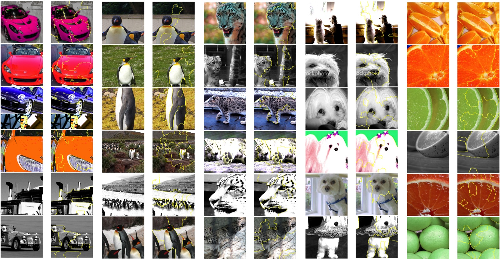
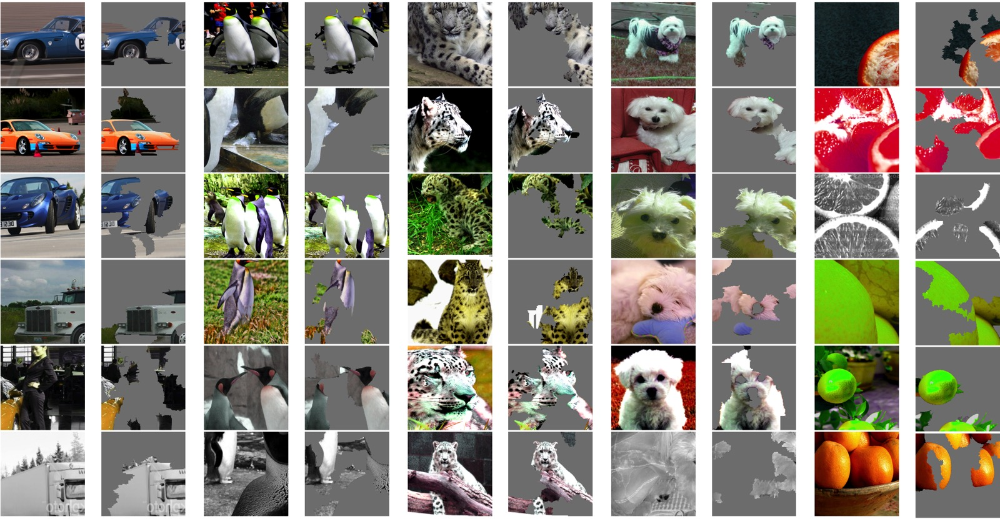
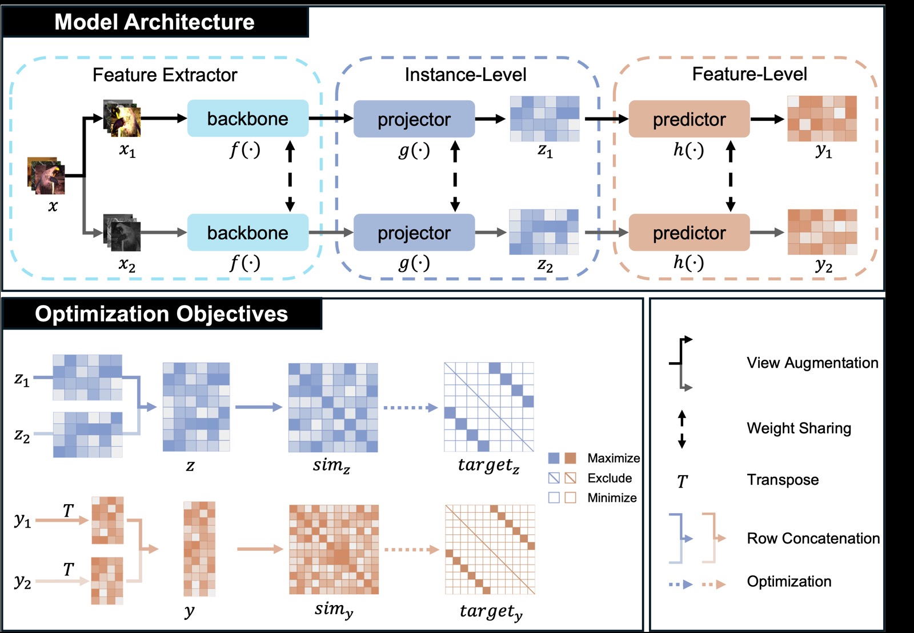
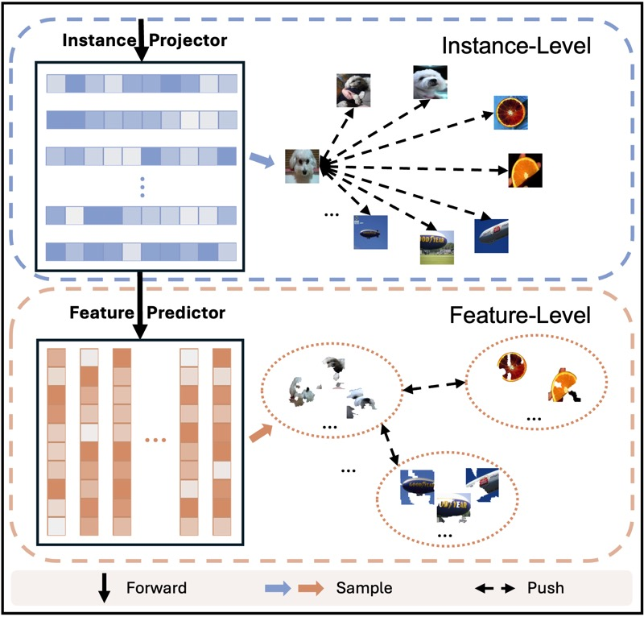

# Learning Fine-grained Representations Without ANY Class Priors

If we assume that the data is unlabeled, why should we rely on knowing the number of classes to construct a network for unsupervised learning? Is the number of classes always important? Could it be possible that class labels don't fully capture the finer-grained features within the dataset? For example, in a dataset of cats vs. dogs, breaking the labels further into white cats, non-white cats, and dogs is also a valid categorization.

In this project, we propose a new model framework that eliminates the implicit assumption of relying on the number of classes, thus avoiding constraining the model to predefined tasks. This approach enables the capture of more fine-grained features from the data. Experiments show that CD outperforms **SimCLR** in feature extraction capability, and pre-trained models for downstream task development are available for download in the [Clustering Results](https://github.com/Hoper-J/Contrastive-Disentangling?tab=readme-ov-file#clustering-results). Additionally, the **final layer output** of the model is able to capture more semantically rich information on more complex datasets. For example, in clustering tasks, applying k-means directly to the final layer output under identical experimental configurations results in a 13.4% improvement in NMI, a 23.1% improvement in ARI, and a 10.9% improvement in ACC on the STL-10 dataset. On the ImageNet-10 dataset, NMI improved by 26.8%, ARI by 110.2%, and ACC by 53.1% compared to **SimCLR-style** models. We found that as training progresses, CD tends to stabilize, whereas SimCLR shows considerable fluctuations. You can check the corresponding reports here: [STL-10](https://wandb.ai/hoper-hw/CD_STL-10/reports/CD-vs-SimCLR-style-BS128-STL-10--Vmlldzo5Mzc4MzUw) | [ImageNet-10](https://wandb.ai/hoper-hw/CD_ImageNet-10/reports/CD-vs-SimCLR-style-BS128-ImageNet-10--Vmlldzo5MzczMjIy).

The figures below showcase the LIME (Local Interpretable Model-Agnostic Explanations) visualizations of the feature prediction heads from the pre-trained model, as well as the contrastive learning structure used in the model.

| Yellow-circled |       |
| -------------- | -------------------------------------- |
| Unmasked       |  |

|  |  |
| --------------------------------- | -------------------------------- |

The following table presents the t-SNE visualizations of the model's feature extraction layer (Backbone) and the output layer (Feature Predictor).

|          | CIFAR-10                                              | CIFAR-100-20                                           | STL-10                                                   | ImageNet-10                                         |
| -------- | ----------------------------------------------------- | ------------------------------------------------------ | -------------------------------------------------------- | --------------------------------------------------- |
| Backbone | .jpeg) | .jpeg) | .jpeg) | .jpeg) |
| Feature  | .jpeg)  | .jpeg)  | .jpeg)  | .jpeg)  |

## Hardware and Software Configuration

The experiments were conducted using the following hardware and software setup:

- **Hardware**: NVIDIA RTX 3090 (24GB) and 18 vCPU AMD EPYC 9754
- **Software**: Python 3.10, PyTorch 2.1.2 + cu121

When the batch size is set to 128, the memory usage will reach **over 11GB**.

**Estimated Training Time (Based on the Current Configuration)**

| Dataset     | Time per Epoch   | Total Time (1000 epochs) |
| ----------- | ---------------- | ------------------------ |
| CIFAR-10    | 2m 51s (171 sec) | 47.5 hours               |
| CIFAR-100   | 2m 51s (171 sec) | 47.5 hours               |
| STL-10      | 38 seconds       | 10.5 hours               |
| ImageNet-10 | 40 seconds       | 11.1 hours               |

If you choose to use the full dataset (train + test) to evaluate metrics after each epoch, the total experiment time may increase by approximately 30%.

You can modify evaluation behavior through the [config/config.yaml](https://github.com/Hoper-J/Contrastive-Disentangling/blob/1bbb64a21eab17aed9b8effb0e72bcac80be8d52/config/config.yaml#L39) file. Setting `evaluation_mode` to `all` evaluates the full dataset after each epoch, `none` evaluates only after training is complete or every 100 epochs when recording records, and `values` between 0 and 1 represent the percentage of the full dataset used for evaluation (e.g., 0.1 uses 10% of the dataset).

## Experiment Records

Here are my experiment records, which may provide useful insights:

- CIFAR-10: [Link](https://wandb.ai/hoper-hw/CD_CIFAR-10?nw=nwuserhoperhw)
- CIFAR-100: [Link](https://wandb.ai/hoper-hw/CD_CIFAR-100?nw=nwuserhoperhw)
- STL-10: [Link](https://wandb.ai/hoper-hw/CD_STL-10/workspace?nw=nwuserhoperhw)
- ImageNet-10: [Link](https://wandb.ai/hoper-hw/CD_ImageNet-10/workspace?nw=nwuserhoperhw)

Please note that the experiments recorded in wandb might differ from the ones you run locally. During subsequent development, I made adjustments to certain function details for improved code readability, even though the core functionality remained unchanged. Additionally, differences in hardware can also impact the results.

By using the [set_seed()](https://github.com/Hoper-J/Contrastive-Disentangling/blob/245686bfeedb39561fc477d3724505c798a0282b/utils/general_utils.py#L18) function, you can ensure that future runs on your current machine will produce consistent results.

If you need to log experiment metrics, set `use_wandb` to `true` in the [config/config.yaml](https://github.com/Hoper-J/Contrastive-Disentangling/blob/1bbb64a21eab17aed9b8effb0e72bcac80be8d52/config/config.yaml#L42), as the default value is `false`.

### Clustering Results

We present the clustering performance at the 1000th epoch to evaluate the effectiveness of our feature learning. The corresponding t-SNE visualizations can be found above. This performance is obtained by applying k-means clustering on the output during the evaluation phase. The corresponding pre-trained models are available for download. The two tables below show the clustering results for the ResNet34 Backbone and the final output of the model (Feature Predictor).

#### Backbone (ResNet34)

| Dataset      | Models | NMI   | ARI   | ACC   | Pre-trained Model                                            |
| ------------ | ------ | ----- | ----- | ----- | ------------------------------------------------------------ |
| CIFAR-10     | CD-128 | 0.725 | 0.620 | 0.800 | [Download](https://drive.google.com/file/d/1joZEzN2ElmpZB8Of1o2c6xJ_FWSu8iPB/view?usp=share_link) |
|              | CD-256 | 0.734 | 0.635 | 0.807 | [Download](https://drive.google.com/file/d/18oFCOBWIAM4EWbc6WqxiDFRmdgFlKLgP/view?usp=share_link) |
| CIFAR-100-20 | CD-128 | 0.462 | 0.240 | 0.418 | [Download](https://drive.google.com/file/d/1m7AJRUMfRmBneIzVnzwmXXqIeFnb-wSH/view?usp=share_link) |
|              | CD-256 | 0.476 | 0.231 | 0.422 | [Download](https://drive.google.com/file/d/1uDPDDHZPi-42opd83NK0o-NPeOohlW24/view?usp=share_link) |
| STL-10       | CD-128 | 0.670 | 0.523 | 0.684 | [Download](https://drive.google.com/file/d/1Cum1N9i80fjstBvTDD0-4TWvlx2aEVsr/view?usp=share_link) |
|              | CD-256 | 0.687 | 0.581 | 0.758 | [Download](https://drive.google.com/file/d/1dteqVIpM7F-082Ibm_1azkn08MBM8pzM/view?usp=share_link) |
| ImageNet-10  | CD-128 | 0.893 | 0.858 | 0.927 | [Download](https://drive.google.com/file/d/1FnNrtaOzjYfBW01hkzYawnro8DPkD3pv/view?usp=share_link) |
|              | CD-256 | 0.885 | 0.854 | 0.934 | [Download](https://drive.google.com/file/d/1DdEbbMEfYKZHVKUYZxOjovFxKDVZ_7Ui/view?usp=share_link) |

CD is a basic and general contrastive learning framework. Compared to the SimCLR framework, which shares similar attributes, CD demonstrates improvements in backbone feature extraction capability. Both frameworks follow identical training configurations and use the same training strategy, with the only difference being the inclusion of a feature-level component in CD. The table below highlights the improvements in backbone feature extraction between CD and SimCLR:

| Dataset     | Model  | NMI                 | ARI                 | ACC                 |
| ----------- | ------ | ------------------- | ------------------- | ------------------- |
| STL-10      | SimCLR | 0.659 ± 0.016       | 0.530 ± 0.028       | 0.692 ± 0.030       |
|             | CD     | ***0.674 ± 0.015*** | ***0.545 ± 0.032*** | ***0.701 ± 0.034*** |
| ImageNet-10 | SimCLR | 0.870 ± 0.022       | 0.809 ± 0.064       | 0.886 ± 0.058       |
|             | CD     | ***0.886 ± 0.008*** | ***0.844 ± 0.022*** | ***0.918 ± 0.026*** |

You can try using our model as a pretext model for downstream experiments.

#### Full Model (Feature Predictor)

| Dataset      | Models | NMI   | ARI   | ACC   | Pre-trained Model                                            |
| ------------ | ------ | ----- | ----- | ----- | ------------------------------------------------------------ |
| CIFAR-10     | CD-128 | 0.711 | 0.624 | 0.788 | [Download](https://drive.google.com/file/d/1arYOsHhWPUJ3pmUL038UK1yvlG1CJD50/view?usp=share_link) |
|              | CD-256 | 0.706 | 0.621 | 0.782 | [Download](https://drive.google.com/file/d/1ioTjfk5IZqHqImbBtexA-XIIqp5PY3AB/view?usp=share_link) |
| CIFAR-100-20 | CD-128 | 0.438 | 0.249 | 0.394 | [Download](https://drive.google.com/file/d/1z9uGHRPXa05Eif3oD7VFlhX_mnyHZj4m/view?usp=share_link) |
|              | CD-256 | 0.446 | 0.254 | 0.416 | [Download](https://drive.google.com/file/d/1OqN51a-3_v8-dA0OCC_lUSPvlf10fX3O/view?usp=share_link) |
| STL-10       | CD-128 | 0.687 | 0.549 | 0.702 | [Download](https://drive.google.com/file/d/1RXLzAqeOjkQPDMNijOFsKExikp7CfK1W/view?usp=share_link) |
|              | CD-256 | 0.668 | 0.572 | 0.734 | [Download](https://drive.google.com/file/d/1gQVmBMKU4yA4WwWtgj2E78G6iprLVPg_/view?usp=share_link) |
| ImageNet-10  | CD-128 | 0.898 | 0.869 | 0.932 | [Download](https://drive.google.com/file/d/1jd8ytearAc_KgxdqldgUjWtTwtejIOp5/view?usp=share_link) |
|              | CD-256 | 0.887 | 0.861 | 0.928 | [Download](https://drive.google.com/file/d/1PApnbNW4KuuC1wWHpWtzRaTCwHYQGfcl/view?usp=share_link) |

Additionally, the **Feature Predictor output** of CD is more meaningful. We further compare it with the final output of SimCLR in terms of clustering metrics.

| Dataset     | Models | NMI                 | ARI                 | ACC                 |
| ----------- | ------ | ------------------- | ------------------- | ------------------- |
| STL-10      | SimCLR | 0.599 ± 0.029       | 0.458 ± 0.043       | 0.649 ± 0.053       |
|             | CD     | ***0.679 ± 0.007*** | ***0.564 ± 0.023*** | ***0.720 ± 0.026*** |
| ImageNet-10 | SimCLR | 0.708 ± 0.031       | 0.413 ± 0.060       | 0.608 ± 0.065       |
|             | CD     | ***0.898 ± 0.003*** | ***0.868 ± 0.006*** | ***0.931 ± 0.003*** |

It can be observed that the feature disentanglement capability of SimCLR’s final output layer is significantly lower than that of its Backbone, whereas CD does not exhibit this issue.

## Pre-trained Models and Checkpoints

All models and checkpoints related to the experiments can be found at the following link:

[**Google Drive**](https://drive.google.com/drive/folders/1GP6PBjzTYJLAehMgbLLFmBMa0KeFeH-M?usp=share_link)

In the **Records** folder, you will find .csv files that log the training status every 100 epochs. You can quickly review these files to decide whether to load the corresponding model files. You can also use load_checkpoint() in [utils/checkpoints.py](https://github.com/Hoper-J/Contrastive-Disentangling/blob/a96bb56a74d3ab98aeebd77f6a335f7013c87549/utils/checkpoint.py#L37) to extract the records from the corresponding checkpoint.

Please note that the files in the **best models** folder refer to models where the **Feature Predictor** output achieved the best **NMI** scores, not the backbone.

## How to Use Trained Model

We provide a `How to Use Trained Model.ipynb` file to help you quickly view the metrics of the pre-trained models. Additionally, we include a **toy example** that demonstrates how to apply the model to downstream tasks. We hope this example is helpful to you.

# Quick Start

## Environment Setup

We recommend using a more recent environment configuration to achieve the best performance. However, we also provide compatible installation instructions for older versions. If you need to run the model in a lower version environment, please refer to the compatible configuration below.

### Create a Virtual Environment and Install Dependencies

1. Create a virtual environment (recommended Python 3.8 or higher):

   ```bash
   conda create -n CD python=3.8
   ```

   - For compatibility with older versions (Python 3.7 or lower):

   ```bash
   conda create -n CD python=3.7
   conda activate CD
   ```

2. Install PyTorch and CUDA:

   - Recommended version:

     ```bash
     # Using pip
     pip install torch torchvision torchaudio
     
     # Or using conda
     conda install pytorch::pytorch torchvision torchaudio -c pytorch
     ```

   - Compatibility version:

     ```bash
     # Using pip
     pip install torch==1.1.0 torchvision==0.3.0 -f https://download.pytorch.org/whl/cu100/torch_stable.html
     
     # Or using conda
     conda install pytorch==1.1.0 torchvision==0.3.0 cudatoolkit=10.0 -c pytorch
     ```

3. Install other dependencies (for all versions):

   ```bash
   # Data processing and scientific computation
   pip install numpy pandas scikit-learn 
   
   # Image processing and computer vision
   pip install opencv-python 
   
   # Progress bar, configuration file handling, and visualization
   pip install tqdm pyyaml matplotlib
   
   # Experiment management and logging
   pip install wandb
   ```

4. Verify that PyTorch and CUDA are installed correctly:

   ```python
   import torch
   print(torch.__version__)  # Check the PyTorch version
   print(torch.cuda.is_available())  # Verify if CUDA is available
   ```

### ImportError: cannot import name 'PILLOW_VERSION' from 'PIL'

If you encounter this error during runtime, try resolving it with the following command:

```bash
pip install Pillow==6.2.2  # You can also try pip install Pillow==10.2.0
```

### Install Dependencies Using Requirements Files (Compatibility Version)

We provide `requirements.txt` and `environment.yml` files that list the minimum environment requirements for running the experiments. Although it might work in lower environments, we have not tested it extensively. You can install the dependencies as follows:

```bash
# Using pip
pip install -r requirements.txt

# Or using conda
conda env create -f environment.yml
conda activate CD
```

### Important Notes

- Versions of **PyTorch below 1.6.0** may not load the pre-trained models we provide (this does not affect loading your own trained files). Therefore, if you want to use our pre-trained models, we recommend using a more recent environment.

- Based on simple testing, using **PyTorch 1.11.0 + CUDA 11.3** provides about a **9%** performance improvement compared to **PyTorch 1.1.0 + CUDA 10** for current experiments.

## Dataset Preparation

CIFAR-10, CIFAR-100, and STL-10 datasets can be automatically downloaded through the code. For **ImageNet-10**, you can download it via Kaggle from the command line:

```bash
kaggle datasets download -d liusha249/imagenet10
```

## Start Training

You can start training the model using the following command. Use the `python train.py --dataset [dataset_name]` command to specify the dataset you want to use with the `--dataset` argument.

**Supported dataset names** include:

- `cifar10`
- `cifar100`
- `stl10`
- `imagenet10`

For example, to run experiments on the **STL-10** dataset, use the following command:

```bash
python train.py --dataset stl10
```

The configuration file is located at [config/config.yaml](https://github.com/Hoper-J/Contrastive-Disentangling/blob/master/config/config.yaml) and will be loaded based on the dataset specified.

Ensure that the environment is set up correctly and the corresponding datasets are prepared before running training. The metrics and results during training can be viewed in **wandb** (if logging is enabled).

## Model Evaluation

To evaluate the model on the **STL-10** dataset, use the following command:

```bash
python evaluate.py --dataset stl10
```

You can also use the `--epoch` argument to evaluate a model saved at a specific training epoch (e.g., the model saved at epoch 800):

```bash
python evaluate.py --dataset stl10 --epoch 800
```

If you have a specific model file path, use the `--model` argument:

```bash
python evaluate.py --dataset stl10 --model path/to/model.pth
```

**Notes:**

- When the `--model` argument is specified, the `--epoch` argument will be ignored.
- If neither `--model` nor `--epoch` is provided, the epoch set in [config/config.yaml](https://github.com/Hoper-J/Contrastive-Disentangling/blob/master/config/config.yaml) will be used by default.

# Appendix

Here, we address some potential questions you may have:

1. **Why is there special handling for CIFAR-100 in `dataset.py`?**

   This is to ensure consistency with the paper's description. Based on [CC](https://arxiv.org/pdf/2009.09687) and [PICA](https://openaccess.thecvf.com/content_CVPR_2020/papers/Huang_Deep_Semantic_Clustering_by_Partition_Confidence_Maximisation_CVPR_2020_paper.pdf) as well as earlier papers, it was noted that they actually use the CIFAR-100 super-classes as labels (i.e., CIFAR-100-20). This doesn’t affect the model’s training; models trained on CIFAR-100-20 can be directly evaluated on CIFAR-100 with all 100 classes.

   While reproducing the CC experiment, we found that their open-source code did not map CIFAR-100 to super-classes despite using 20 classes in the paper. To address this, we redefined CIFAR-100 according to PICA’s definition. This could explain why the CIFAR-100 baseline in our paper is slightly lower than in the original. To avoid confusion, we have provided a full record of the metric curves, which you can view [here](https://wandb.ai/hoper-hw/CFL-cifar100/reports/CD-vs-CC-BS256-CIFAR-100--Vmlldzo5MTU3ODY0?accessToken=cz7tu971sasummgncnn49w1jgr7c7l42ngqrkgzaqux8kzn8exuglfi85lu14lwo).

2. **Why is the STL-10 baseline lower than in the original CC paper?**

   When reproducing the CC experiment, we discovered that CC actually used **train (5,000) + test (8,000) + unlabeled (100,000)** data for training, not just the train and test data. The original baseline also used unlabeled data, which explains why training on STL-10 took the longest in the CC paper (160 GPU-hours on STL-10). The process involved first training on the unlabeled data at the instance level, followed by normal training on the **train + test** dataset using the CC architecture. However, instance-level training was not the primary focus of the CC paper; it was more of a SimCLR characteristic.

   We know that adding more data at the instance level leads to performance gains, as it doesn't rely on prior knowledge. However, proper evaluation of a model’s performance should ensure that all models are trained consistently. Otherwise, the model can be trained with unlabeled data during each epoch, which would lead to improvements, but the gains may not be attributed entirely to the proposed method. This is not to diminish CC or its predecessors. In fact, CC itself outperformed previous baselines even when trained for 11 GPU-hours on **train + test** alone, without using unlabeled data.

   To ensure a proper comparison of our model’s effectiveness, we retrained CC on the **train + test** data for STL-10. You can view the complete experimental record [here](https://wandb.ai/hoper-hw/CFL-stl10/reports/CD-vs-CC-BS256-STL-10--Vmlldzo5MTU3OTM1?accessToken=um3y7bsplqdiz6slkt034ht8dras7f0en0ymkufy78fh6btcrij1qg4zimiohovy).

   Additionally, we reproduced results for other datasets in the same environment (without changing the baseline in the paper, but to provide a comparative demonstration). The results were mostly consistent with the original CC paper. Check out the comparisons for other datasets: [CIFAR-10](https://wandb.ai/hoper-hw/CFL-cifar10/reports/CD-vs-CC-BS256-CIFAR-10--Vmlldzo5MjU4ODY0?accessToken=y2auazsouib91c2bsj1ujxbwgv9dr7001hxih4xbdkc5wgjwtrs2sbrjghny4kzp) and [ImageNet-10](https://api.wandb.ai/links/hoper-hw/phq1m25i).

3. **Why does wandb show a longer runtime than described in the paper?**

   There are three main reasons:
   - We evaluate the full dataset after each epoch, which increases the actual computation time (common).
   - Multiple experiments are running concurrently on the same GPU  (common).
   - Remote server shutdowns may cause wandb to record extra time due to lack of a termination signal.

4. **Is 1000 epochs where the model reaches its best performance?**

   Not necessarily. We took additional time to record experimental metrics to show the changes in performance over time, rather than treating the training process as a black box where you tweak hyperparameters and wait for results. As the curves suggest, **CIFAR-10** and **CIFAR-100** still have room for improvement (+2%/1000 epochs). If you'd like to continue training the model beyond 1000 epochs, you can simply increase the number of `epochs` in the config and set `reload=True` to resume training.

5. **Why is the random seed fixed to 42?**

   We fixed the random seed to 42 for consistency with previous baselines. However, unlike previous work, we also set `torch.backends.cudnn.deterministic = True` and `torch.backends.cudnn.benchmark = False` to ensure reproducibility.

   Therefore, for the same experimental config, you don’t need to re-run the code to verify the results. You can check the recorded runs on [wandb](https://github.com/Hoper-J/Contrastive-Disentangling/tree/master?tab=readme-ov-file#experiment-records).

6. **Is batch size=256 better than batch size=128?**

   Not necessarily. Larger batch sizes do not always yield better results. Our model already performs well with a batch size of 128. This is a common misconception, sometimes fueled by the availability of larger GPUs: "Why use only 12GB if you have more?"

7. **How to handle the `UserWarning: Plan failed with a cudnnException` warning?**

   This warning is related to cuDNN’s handling of certain convolution operations in PyTorch. It appears because we set `torch.backends.cudnn.deterministic = True` to ensure reproducibility. You can adjust the `set_seed()` function in [utils/general_utils.py](https://github.com/Hoper-J/Contrastive-Disentangling/blob/245686bfeedb39561fc477d3724505c798a0282b/utils/general_utils.py#L18) by setting `torch.backends.cudnn.deterministic = False` and `torch.backends.cudnn.benchmark = True` if you prioritize training speed over result reproducibility.

8. **Why use `torch.mm()` instead of `nn.CosineSimilarity()` for loss computation?**

   After normalizing the vectors, their magnitudes become 1, making the dot product equivalent to the cosine similarity.
